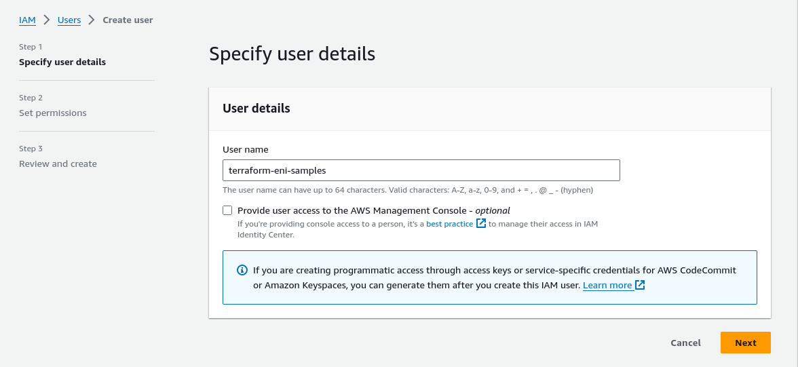
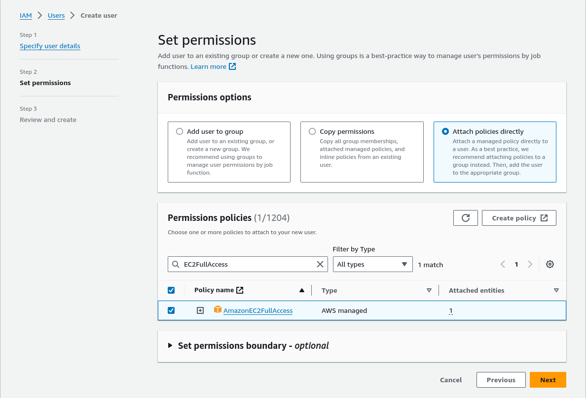
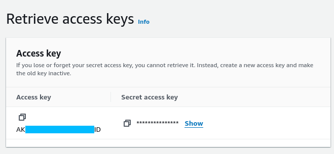

# AWS Instances & Load Balancer

Useful links:

| Descrption                               | Link                                                                             |
|------------------------------------------|----------------------------------------------------------------------------------|
| Provider documentation                   | https://registry.terraform.io/providers/hashicorp/aws/latest                     |
| AWS IAM Console                          | https://us-east-1.console.aws.amazon.com/iam/home#/users                         |
| Creating an IAM user in your AWS account | https://docs.aws.amazon.com/IAM/latest/UserGuide/id_users_create.html            |
| Managing access keys for IAM users       | https://docs.aws.amazon.com/IAM/latest/UserGuide/id_credentials_access-keys.html |

## Pre-requisites

* An AWS Account with EC2 permissions
* AWS Credentials (see _Getting credentials_ step)

## Getting credentials

Credentials car be generated for an AWS user in the IAM
console : https://us-east-1.console.aws.amazon.com/iam/home#/users

First, create a user if you don't already have one :

The user should have permissions on the EC2 Service to be able to create instances & load-balancers :

> Permissions shouldn't be attached directly to a user, use a group instead.

Then generate access keys for your user : https://docs.aws.amazon.com/IAM/latest/UserGuide/id_credentials_access-keys.html

Take note of the generated _Access Key_ and _Secret Access Key_. 

## Required env vars

This project needs 2 environment variables in order to be run :

| env                   | value                                                 |
|-----------------------|-------------------------------------------------------|
| AWS_ACCESS_KEY_ID     | The Access Key generated at the previous step    |
| AWS_SECRET_ACCESS_KEY | The Secret Access Key generated at the previous step |

## Running the code

This code manages a network with 3 subnets, an ubuntu instance on each subnet, and a HTTP load-balancer forwarding requests to the instances.

In order to use this code on an existing network, replace the contents of the `networks.tf` file with `datasource` blocs for your own network configuration.
